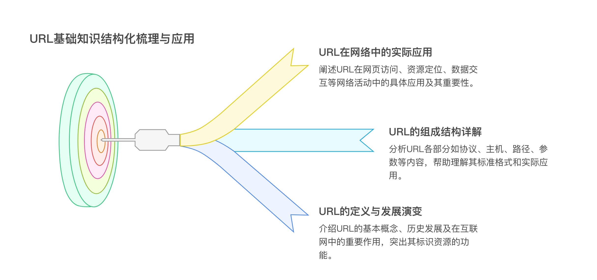
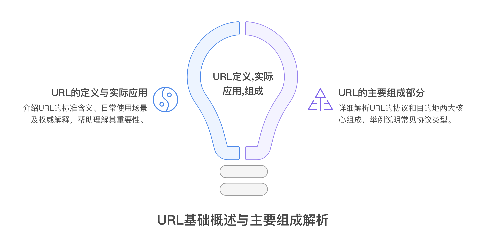
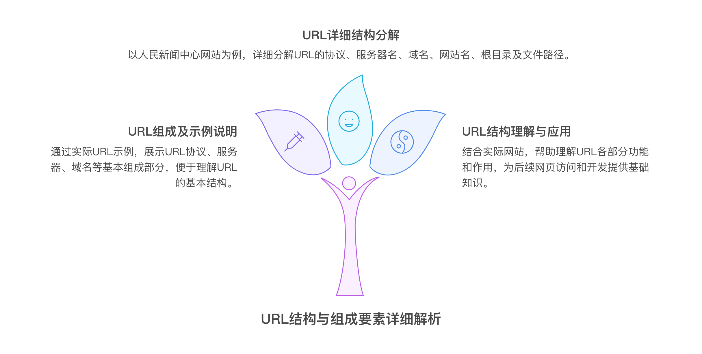
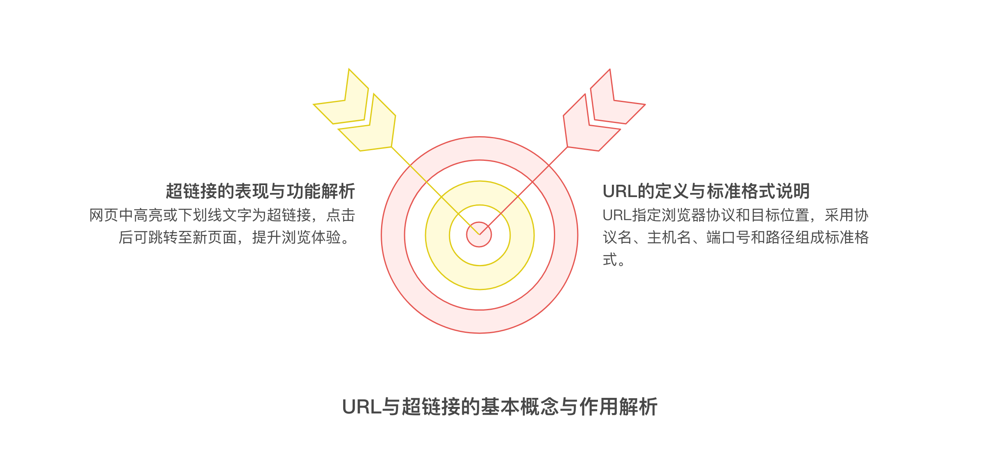
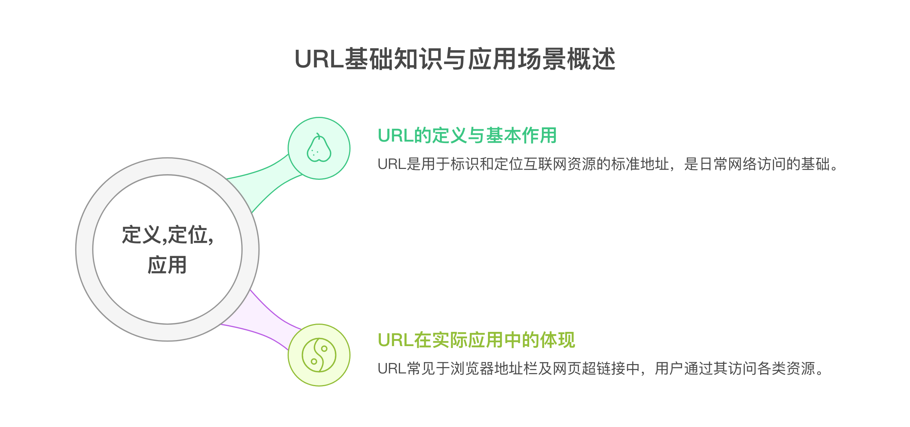
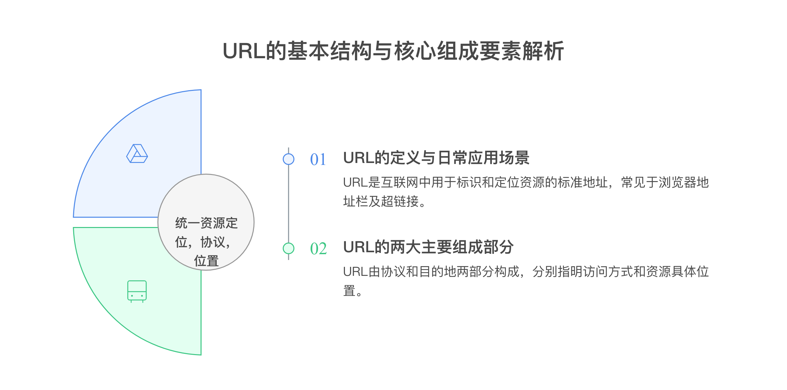

# 什么是URL

**URL（统一资源定位符）基础知识工作汇报**

**1. URL概述**

**定义**：URL（Uniform Resource Locator，统一资源定位符）是用于标识和定位互联网上资源的标准地址。

**实际应用**：在日常互联网使用中，URL即为网页地址，显示在浏览器顶部的地址栏中。当鼠标悬停在超链接上时，相关URL会出现在浏览器底部。

**权威解释**：据百度百科，URL是对可以从互联网上获取的资源的位置及访问方法的简洁表示。每个互联网上的文件都有唯一的URL，指明其位置及浏览器的处理方式。

**2. URL的主要组成部分**

**协议（Protocol）**：指明所访问的Internet资源类型。例如：

http：用于访问HTML网页，是Web中最常见的协议

其他协议：ftp、gopher、telnet等

**目的地（Destination）**：可以是文件名、目录名或计算机名称，用于定位具体资源。

**组成举例**

**示例1**：[http://www.zjou.edu.cn/index.html](http://www.zjou.edu.cn/index.html)

浏览器可通过该URL准确获取HTML文档的位置和文件名。

**示例2**：[ftp://ftp.netscape.com](ftp://ftp.netscape.com/)

浏览器会自动登录到Netscape的FTP站点。

**3. URL详细结构分析（以“人民新闻中心网站”为例）**

**URL实例**：[http://www.peopledaily.com.cn/GB/news/index.html](http://www.peopledaily.com.cn/GB/news/index.html)

**结构分解：**

**协议**：http:// —— HTTP超文本传输协议

**服务器名**：www —— 因特网信息网的服务器名称

**域名**：peopledaily.com.cn —— 网站的唯一定位名称

**网站名**：www.peopledaily.com.cn —— 由服务器名和域名组成

**根目录**：/ —— 服务器存放网页的根目录

**文件路径**：GB/news/index.html —— 根目录下的具体网页

**4. URL与超链接**

**超链接表现**：网页中带有高亮、下划线或不同颜色的文字通常为超链接。当鼠标悬停时，指针形状发生变化，表示该文字“可单击”。

**功能**：点击超链接可直接跳转至新页面，浏览器根据关联的URL定位并下载目标文件。

**5. URL的作用和格式**

**作用**：URL告诉浏览器应使用哪种协议，并在网络的何处查找目标文件。

**标准格式**：

协议名://主机名[：端口号]/[路径名/…/文件名]

**主机名**：可为域名或IP地址。

**使用方式**：用户只需在浏览器地址栏输入URL即可访问目标网页。

**URL（统一资源定位符）工作汇报**

**一、URL概述**

- *统一资源定位符（Uniform Resource Locator，简称URL）**是互联网中用于标识和定位资源的标准地址。在日常互联网应用中，URL随处可见，但许多用户仅知其用法而不了解其本质。URL通常显示在浏览器顶部的地址栏（Location或URL框），或在鼠标悬停于超链接时显示于页面底部。

**定义**：URL是对互联网上资源的位置和访问方法的简洁表示，是互联网资源的标准地址。每个文件在互联网上均有唯一的URL，可明确指示文件位置及浏览器的处理方式。

**引用**：百度百科指出，URL用于定义Web网页的地址，便于用户访问和定位网络资源。

**二、URL的主要组成部分**

URL由以下两个主要部分构成：

**协议（Protocol）**：指明资源的访问方式。例如：

http：用于访问Web中的HTML文档

其他常见协议包括 gopher、ftp、telnet 等

**目的地（Destination）**：指向资源的具体位置，可以是文件名、目录名或计算机名称。

**三、URL实例解析**

以人民新闻中心网站为例：

示例URL：[http://www.peopledaily.com.cn/GB/news/index.html](http://www.peopledaily.com.cn/GB/news/index.html)

**组成结构说明：**

http:// —— 协议（HTTP超文本传输协议）

www —— 服务器名

peopledaily.com.cn —— 域名（网站唯一标识）

www.peopledaily.com.cn —— 网站名（服务器名+域名）

/ —— 根目录（服务器存放网页的起始位置）

GB/news/index.html —— 根目录下的具体网页路径

**四、URL在Web中的作用**

网页中常见的加亮、下划线或变色文字通常为超链接（Hyperlink）。

当鼠标悬停于超链接时，指针形状会发生变化，表明该文字可点击，点击后可跳转至新页面。

浏览器通过URL识别并传送目标网页。例如：“Click here for more information about Tongji University Lib”（单击此处获取更多信息），只要URL正确，浏览器即可访问对应内容。

**五、URL格式标准**

**主机名** = 域名或IP地址

用户只需在浏览器地址栏输入URL即可访问资源

**标准格式**：

协议名://主机名[:端口号]/[路径名/…/文件名]

**六、总结**

URL是互联网资源定位和访问的基础，结构清晰，标准统一。

正确理解和使用URL，有助于提升信息获取效率和网络资源管理能力。