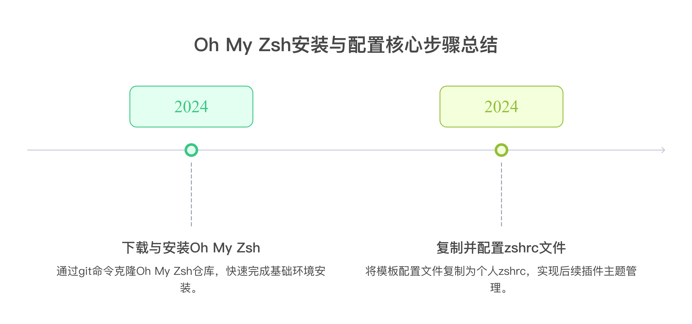
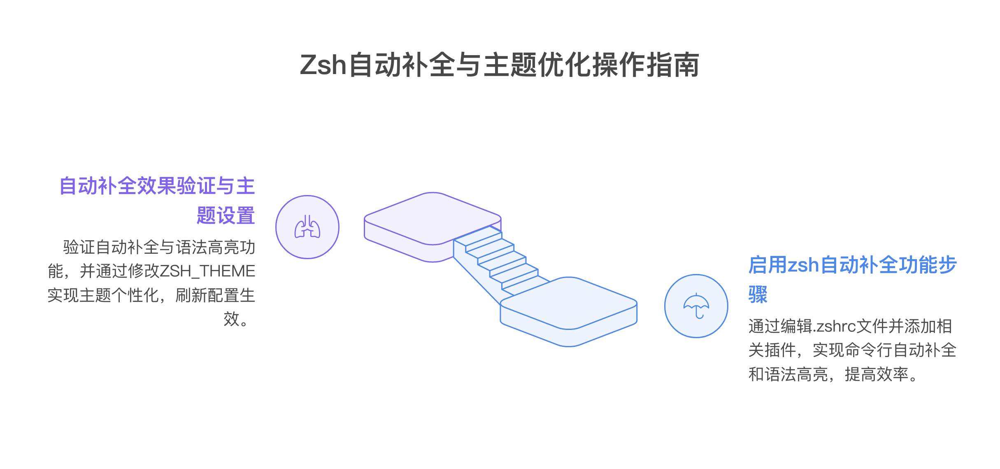

# kali更新补全键

**Oh My Zsh 安装与配置工作汇报**

**1. 安装 Oh My Zsh**

**执行命令：**

git clone --depth=1 https://github.com/ohmyzsh/ohmyzsh.git ~/.oh-my-zsh

**2. 复制配置文件**

**操作步骤：**

cp ~/.oh-my-zsh/templates/zshrc.zsh-template ~/.zshrc

**目的说明：**

创建个人配置文件 ~/.zshrc

后续所有插件、主题、自动补全等均在此文件中进行配置

**3. 切换默认 Shell（关键步骤）**

**执行命令：**

chsh -s /usr/bin/zsh

**注意事项：**

切换后不会立即生效，需重新打开终端

**4. 启动 zsh**

**推荐方式：**

zsh

**成功标志：**

终端提示符变为类似 ➜ ~

或出现主题变化（如箭头、颜色等）

**5. 确认 Shell 切换成功**

**验证命令：**

echo $SHELL

**预期输出：**

/usr/bin/zsh

**6. 启用自动补全功能**

**操作步骤：**

打开配置文件：

vi ~/.zshrc

修改插件配置：

plugins=(git zsh-autosuggestions zsh-syntax-highlighting)

**7. 安装插件**

**执行命令：**

git clone https://github.com/zsh-users/zsh-autosuggestions ~/.oh-my-zsh/custom/plugins/zsh-autosuggestions

git clone https://github.com/zsh-users/zsh-syntax-highlighting ~/.oh-my-zsh/custom/plugins/zsh-syntax-highlighting

**8. 刷新配置**

**执行命令：**

source ~/.zshrc

**9. 效果验证与主题优化**

**自动补全与语法高亮：**

输入命令时将看到灰色自动补全提示（autosuggestions）

命令语法有颜色高亮（highlighting）

**主题更换（可选）：**

编辑 .zshrc 文件，找到并修改主题配置：

ZSH_THEME="robbyrussell"

可更换为：

ZSH_THEME="agnoster"

或

ZSH_THEME="bira"

刷新配置：

source ~/.zshrc

